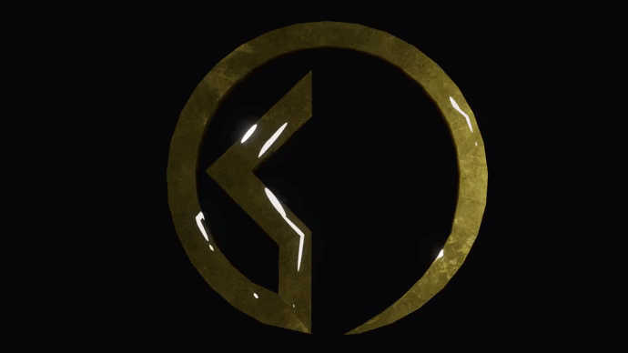

### David Moisan - Développeur Full Stack Junior 👋      

### 📚 Actuellement en Master Ingénieur Informatique avec l'école EPSI   

### Diplômes obtenus :
- 🥇 Licence Chef de projet                                             
- 🥇 BTS Développeur web et mobile                                      
                                                                       
### 💬 Back : 

     
                                   

### 💬 Front : 

                       
                                                                        
==========================================================================

### GitHub Analytics

  

==========================================================================
### Daily Dev  
  

